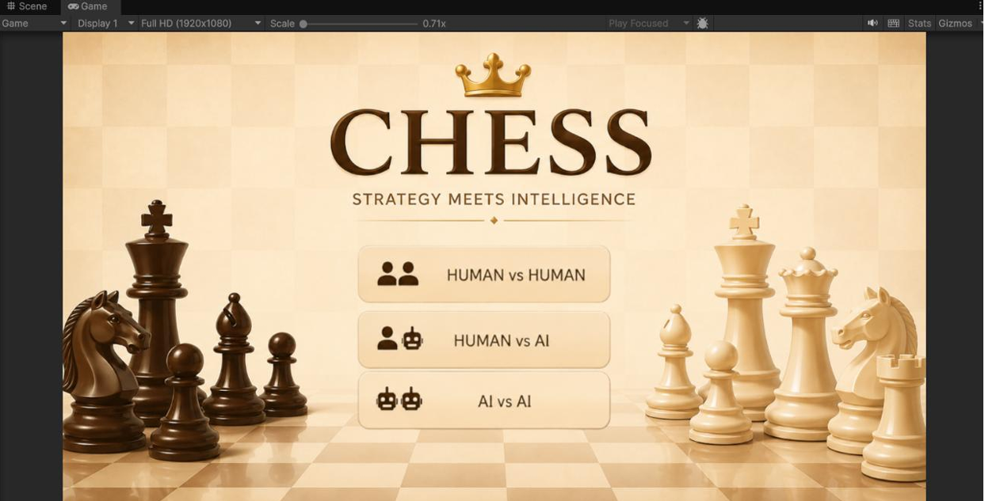
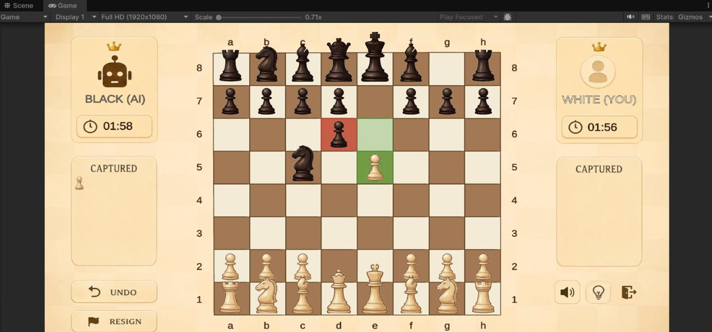
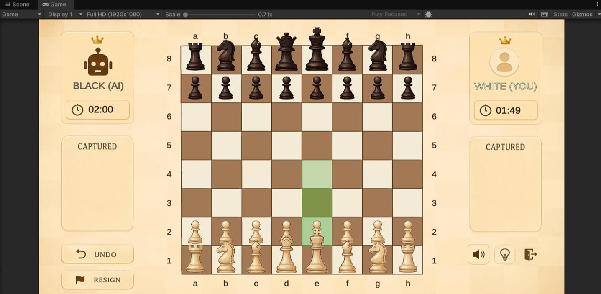
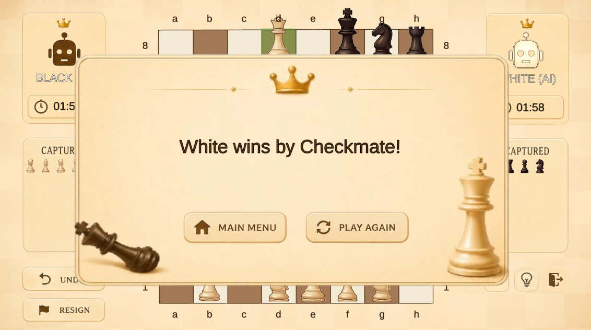
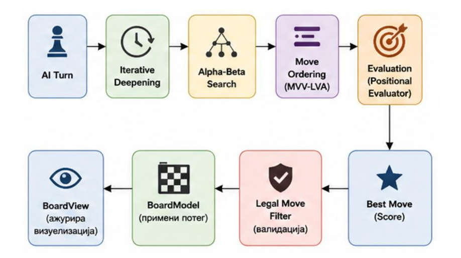
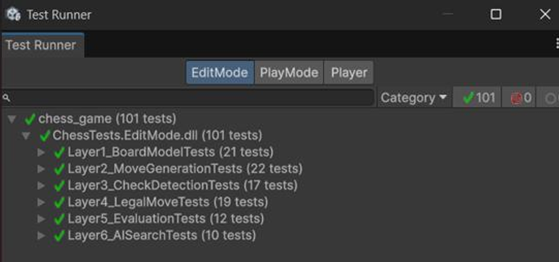

# ChessAI - Unity Game

A 2D chess game built in **Unity 6**, powered by a from-scratch AI opponent implementing classic game-tree search techniques from *Ian Millington's AI for Games (3rd Edition), Chapter 9 - Board Games*.

The AI combines **NegaMax, Alpha-Beta Pruning, MVV-LVA Move Ordering, Iterative Deepening, and Quiescence Search** into a time-bounded search system capable of evaluating thousands of chess positions while keeping the Unity gameplay responsive.

  

---

## Highlights

- **NegaMax + Alpha-Beta Pruning (fail-soft)** - reduces the search space by eliminating branches that cannot affect the final decision, with recorded AI-vs-AI games showing roughly **100-400 pruned branches per move**.

- **Move Ordering (MVV-LVA)** - prioritizes captures using the *Most Valuable Victim - Least Valuable Aggressor* principle, helping Alpha-Beta find promising moves earlier and prune more effectively.

- **Iterative Deepening** - progressively searches depths **1 → 2 → 3** within a **2000 ms time budget**, preserving the best move from the last fully completed depth if time runs out.

- **Quiescence Search with stand-pat** - extends the search through capture sequences beyond the normal depth limit to reduce the **horizon effect** and avoid evaluating tactically unstable positions.

- **Decoupled architecture** - chess logic (`BoardModel`) is independent of Unity rendering, allowing the AI search to operate on cloned board states without modifying the live game.

- **Background AI search** - computation runs on a ThreadPool background thread, preventing the search from blocking Unity's main thread.

- **Built-in telemetry and testing** - AI performance is automatically exported to CSV, while six layers of NUnit Edit Mode tests cover the core chess and search systems.

---

## Game Modes

| Mode | Description |
| --- | --- |
| **Human vs Human** | Two players play locally |
| **Human vs AI** | Play against the AI opponent |
| **AI vs AI** | Both sides are AI-controlled, useful for automated testing and benchmarking |

During human turns, selecting a piece highlights its legal moves. The game handles captures, castling, en passant, promotion, check, checkmate, stalemate, and draw detection.

---

## Gameplay & UI

The game features a complete chess interface with legal-move highlighting, captured-piece tracking, player timers, game controls, and dedicated end-game screens.

  

  
  

---

## Tech Stack

| | |
| --- | --- |
| **Engine** | Unity 6 (6000.5.0f1) |
| **Language** | C# |
| **Testing** | NUnit Edit Mode Tests |
| **Reference** | *AI for Games*, Ian Millington, 3rd Edition - Chapter 9 |

---

## How It Works

1. **Board Representation** - `BoardModel` stores piece placement, side to move, and special-move state independently of Unity. `Clone()` creates isolated board states that the AI can safely explore.

2. **Move Generation & Legality** - `MoveGenerator` generates pseudo-legal moves, while `LegalMoveFilter` removes moves that would leave the player's own king in check. `CheckDetector`, `SpecialMoveRules`, and `EndConditionChecker` handle the remaining chess rules and game-ending conditions.

3. **Position Evaluation** - `PositionalEvaluator` combines standard material values in centipawns with Piece-Square Tables (PSTs), rewarding or penalizing pieces based on their board position.

4. **AI Search** - `AlphaBetaSearcher` runs NegaMax with fail-soft Alpha-Beta pruning and MVV-LVA move ordering. At the depth limit, Quiescence Search continues through capture sequences until a stable position is reached.

5. **Time Management** - `IterativeDeepeningSearcher` searches depths 1 through 3 within a 2000 ms budget and keeps the result of the last fully completed iteration as a fallback.

6. **Unity Integration** - `AIController` executes the search on a background thread. Before the selected move is applied, it is validated once more through `LegalMoveFilter` as an additional safety check.

  

---

## Position Evaluation

The evaluation function combines **material value** and **positional scoring**.

| Piece | Value |
| --- | ---: |
| Pawn | 100 cp |
| Knight | 320 cp |
| Bishop | 330 cp |
| Rook | 500 cp |
| Queen | 900 cp |
| King | 20,000 cp |

Piece-Square Tables add positional bonuses and penalties - for example, rewarding a centralized knight while penalizing one stuck in a corner.

The final score follows the NegaMax convention: a **positive value represents an advantage for the side to move**.

---

## Performance

Every AI move records:

- Positions searched
- Branches pruned
- Search time
- Evaluation score
- Best move

The results are automatically exported to `chess_metrics.csv` at the end of an AI-vs-AI game.

| Metric | Observed Result |
| --- | --- |
| **Positions searched per move** | Up to ~25,000 |
| **Branches pruned per move** | ~100-400 |
| **Typical search time** | ~100-500 ms |
| **Maximum time budget** | 2000 ms |
| **Maximum search depth** | 3 |

---

## Testing

The core system is covered by **six layers of NUnit Edit Mode tests**, which can run without a Unity scene because the chess rules and AI logic are implemented independently of the presentation layer.

| Layer | Covers |
| --- | --- |
| **Board** | Piece placement, cloning, move application, castling and en passant state |
| **Move Generation** | Correct move generation for every piece type |
| **Check Detection** | Checks, pins, double checks, and edge cases |
| **Legal Move Filtering** | Rejecting moves that leave the player's own king in check |
| **Evaluation** | Material scoring, positional scoring, and NegaMax sign convention |
| **AI Search** | Mate finding, legal-move guarantees, and iterative-deepening timeout handling |

  

  <em>101 NUnit Edit Mode tests passing across all six testing layers.</em>

---

## Reference

The AI system is based on concepts presented in:

**Ian Millington - *AI for Games*, 3rd Edition**  
Chapter 9 - **Board Games**

The project applies these classical game-AI techniques to a complete playable chess environment, combining search, pruning, evaluation, move ordering, time management, and tactical search extensions.
